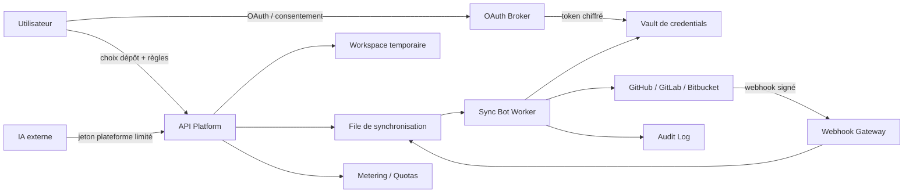
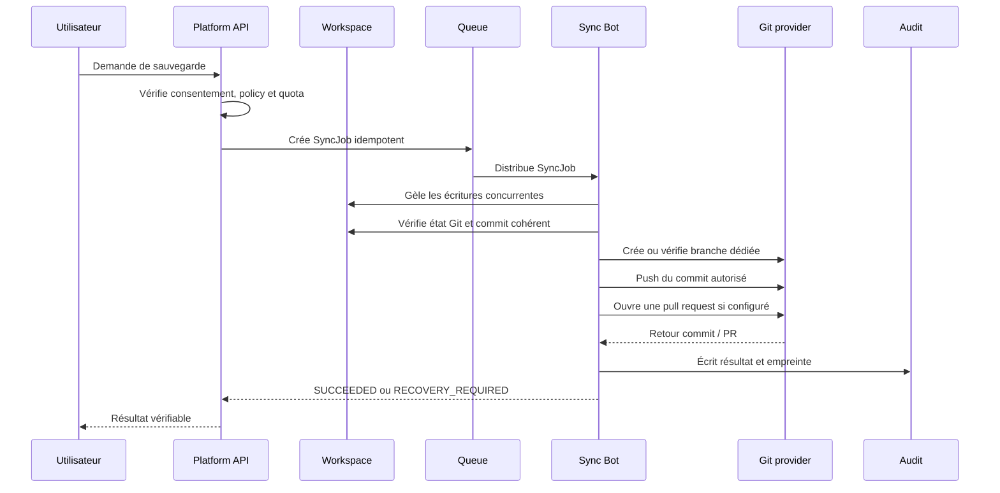

# Spécification technique — bot de synchronisation des dépôts

## 1. Objectif

Le bot de synchronisation permet à la plateforme de fournir des workspaces temporaires tout en conservant le dépôt de référence chez l’utilisateur. Il peut cloner un dépôt autorisé, créer une branche de travail, exécuter des validations, pousser un commit ou ouvrir une pull request. Il peut aussi créer un nouveau dépôt privé uniquement lorsque l’utilisateur l’a demandé et confirmé.

La plateforme héberge l’exécution ; l’utilisateur conserve la propriété, la destination et le contrôle du code.

## 2. Principes non négociables

Le bot applique le principe du moindre privilège. Il ne reçoit jamais un accès global au compte Git, ne lit pas les secrets par défaut, ne fusionne pas automatiquement dans `main` et ne supprime pas de dépôt. Chaque autorisation est liée à un fournisseur, une installation ou un compte, un dépôt, un workspace, une branche, une liste d’actions, une durée et un budget.

Le token OAuth du fournisseur Git ne doit jamais être donné directement à une IA externe. L’IA reçoit uniquement un jeton de plateforme court et limité. Le serveur de la plateforme utilise ensuite, côté backend, les identifiants du fournisseur pour exécuter l’opération autorisée.

## 3. Architecture logique



Le composant **OAuth Broker** réalise l’autorisation et le renouvellement lorsque cela est possible. Le **Vault** conserve les tokens chiffrés, avec une clé de chiffrement gérée séparément. L’API crée des intentions de synchronisation idempotentes. La **file de synchronisation** absorbe les reprises et évite qu’une requête HTTP longue ne pousse directement du code. Le **worker** exécute les opérations Git dans un environnement isolé. La **Webhook Gateway** valide les événements entrants et réveille le worker. Le **Metering** mesure la durée, le stockage, les tests et les ressources consommées.

## 4. États d’un projet

```text
DRAFT
  -> CONNECTED
  -> WORKSPACE_READY
  -> DIRTY
  -> SYNC_REQUESTED
  -> VALIDATING
  -> PUSHED
  -> PR_OPENED
  -> CONFIRMED
  -> ARCHIVED

SYNC_FAILED -> RETRYING -> SYNC_REQUESTED
SYNC_FAILED -> RECOVERY_REQUIRED
```

Un projet ne passe à `ARCHIVED` que si le dernier état autorisé est confirmé sur le dépôt distant ou si l’utilisateur a explicitement accepté la conservation d’un snapshot temporaire. Une suppression de workspace ne doit jamais être considérée comme une sauvegarde réussie sans preuve d’un commit distant, d’une pull request créée ou d’un snapshot récupérable.

## 5. Flux OAuth initial

1. L’utilisateur choisit GitHub, GitLab ou Bitbucket.
2. La plateforme crée un état OAuth aléatoire, à usage unique et à durée courte.
3. Le navigateur est redirigé vers le fournisseur avec uniquement les scopes demandés.
4. Le fournisseur renvoie un `code` vers le callback HTTPS.
5. Le backend vérifie l’état, échange le code côté serveur et récupère l’identité du compte.
6. La plateforme demande à l’utilisateur de sélectionner les dépôts ou l’organisation concernés.
7. Les identifiants sont chiffrés et associés à une installation, un projet et une politique.
8. La plateforme affiche un résumé lisible et attend la confirmation de la sauvegarde.

Le callback ne doit jamais accepter un token envoyé par le navigateur. Les paramètres OAuth sont validés, les codes ne sont pas journalisés et les comptes sont associés par l’identifiant stable du fournisseur plutôt que par un nom affiché.

## 6. Flux de synchronisation



Avant le push, le worker vérifie le dépôt distant, le commit de base, la branche cible et la politique de fichiers sensibles. Il refuse les tokens, clés privées, fichiers `.env`, credentials cloud et artefacts interdits selon les règles du projet. Le worker doit utiliser une branche nommée par exemple `platform/<workspace-id>/<short-id>` et ne pas écrire directement dans `main`.

## 7. Déclencheurs d’inactivité

L’inactivité est un cycle de conservation, pas une permission de copier sans avertissement. Le service peut arrêter un workspace après une période définie, mais doit d’abord envoyer plusieurs notifications. Une sauvegarde automatique n’est autorisée que si l’utilisateur l’a activée avant l’inactivité.

| État | Action |
|---|---|
| Inactivité courte | Notification et maintien du workspace |
| Inactivité prolongée | Proposition de sauvegarde vers le dépôt de référence |
| Proche de l’expiration | Avertissement avec date, contenu et option de prolongation |
| Expiration autorisée | Sync du dernier commit cohérent puis arrêt du workspace |
| Échec de sync | Conservation temporaire, reprise et alerte explicite |
| Retour de l’utilisateur | Recréation depuis le dépôt Git ou le snapshot |

Le job d’inactivité doit être déterministe et idempotent. Il peut être déclenché par un scheduler applicatif ou par un événement de cycle de vie. Les webhooks des fournisseurs servent à réagir aux changements du dépôt ; ils ne remplacent pas le contrôle périodique des workspaces inactifs.

## 8. Permissions OAuth minimales

### GitHub

Pour ce cas d’usage, il faut privilégier une **GitHub App installable** et limitée aux dépôts sélectionnés, plutôt qu’un token personnel global. Les permissions exactes dépendent de chaque endpoint ; GitHub indique qu’une permission insuffisante produit une erreur d’accès et que l’accès Git HTTP via un token d’installation nécessite la permission repository `Contents` [1].

| Besoin | Permission GitHub App recommandée | Niveau |
|---|---|---|
| Identifier le dépôt et lire ses métadonnées | Metadata | Read-only |
| Cloner et lire le code | Contents | Read-only |
| Pousser une branche | Contents | Read and write |
| Créer une pull request | Pull requests | Read and write |
| Lire ou traiter des issues | Issues | Read-only ou Read and write selon le besoin |
| Recevoir les événements de l’application | Webhooks de l’application | Événements strictement sélectionnés |
| Modifier `.github/workflows` | Workflows | Read and write uniquement si indispensable |
| Créer un dépôt | Administration du compte ou de l’organisation | Séparé, confirmation obligatoire |
| Supprimer un dépôt | Administration | Ne jamais demander au bot |

La permission `Workflows` ne doit pas être ajoutée pour un simple push de code ; elle n’est nécessaire que si le produit doit modifier les fichiers de workflow GitHub [1]. La création de dépôt doit être une capacité distincte et non une conséquence automatique du simple accès au code.

### GitLab

GitLab distingue précisément la lecture Git et l’écriture Git. Le scope `read_repository` fournit un accès en lecture seule aux dépôts privés via Git-over-HTTP ou l’API des fichiers. Le scope `write_repository` fournit la lecture-écriture via Git-over-HTTP, mais ne donne pas l’écriture générale de l’API [2].

| Besoin | Scope GitLab | Remarque |
|---|---|---|
| Lire ou cloner un dépôt privé | `read_repository` | Suffisant pour une sauvegarde en lecture |
| Pousser une branche par Git-over-HTTP | `write_repository` | À ajouter seulement pour le push |
| Utiliser l’API générale pour créer une MR ou gérer un projet | `api` | Scope large ; à isoler et demander uniquement si nécessaire |
| Lire l’identité de connexion | `openid`, `profile`, `email` | À utiliser selon le besoin d’identité |
| Gérer un webhook de projet par API | `api` ou configuration administrée séparément | Éviter de donner ce scope au bot de workspace |

Pour réduire les privilèges, la création initiale du projet et du webhook peut être effectuée dans un parcours administré séparément, puis le bot de synchronisation ne conserve que les droits Git nécessaires.

### Bitbucket Cloud

Bitbucket Cloud documente les scopes `repository`, `repository:write`, `pullrequest`, `pullrequest:write` et `webhook`, entre autres, et recommande de déclarer uniquement les scopes nécessaires [3].

| Besoin | Scope Bitbucket Cloud | Niveau fonctionnel |
|---|---|---|
| Lire un dépôt | `repository` | Lecture |
| Pousser une branche | `repository:write` | Écriture du dépôt |
| Lire les pull requests | `pullrequest` | Lecture |
| Créer ou modifier une pull request | `pullrequest:write` | Écriture des pull requests |
| Recevoir ou gérer des webhooks | `webhook` | À activer séparément |
| Administrer un projet | `project:admin` | Ne pas demander au bot |
| Supprimer un dépôt | `repository:delete` | Interdit par défaut |

## 9. Jeton remis à une IA externe

Le token reçu par une IA externe est un token de la plateforme, pas un token GitHub, GitLab ou Bitbucket. Il doit être opaque, haché en base, affiché une seule fois, révocable et limité par les attributs suivants :

| Attribut | Exemple |
|---|---|
| Projet | `project_123` |
| Workspace | `ws_456` |
| Dépôt | `github:org/repo` |
| Branche | `platform/ws-456/*` |
| Actions | `read`, `exec_tests`, `push_branch`, `open_pr` |
| Durée | 30 minutes |
| Budget | 20 minutes CPU, 1 Go de sortie |
| Réseau | registre de paquets autorisé uniquement |
| Secrets | Aucun |
| Fusion | Interdite |

Un appel est refusé si le token est expiré, révoqué, utilisé hors de son workspace ou incompatible avec l’action demandée. Le token est transmis dans `Authorization: Bearer ...` et ne doit jamais apparaître dans les logs, URLs, noms de branches ou messages de commit.

## 10. Modèle de données minimal

```text
connections
  id, user_id, provider, provider_account_id
  encrypted_refresh_token, token_expires_at, revoked_at

repositories
  id, connection_id, provider_repo_id, full_name
  visibility, default_branch, selected_at

sync_policies
  id, repository_id, workspace_id
  mode, inactivity_days, target_branch
  allow_create_repo, allow_push, allow_pull_request
  max_cpu_minutes, max_storage_bytes

sync_jobs
  id, idempotency_key, workspace_id, repository_id
  source_commit, target_branch, state, attempts
  remote_commit, pull_request_url, error_code

bot_tokens
  id, token_hash, workspace_id, repository_id
  scopes, expires_at, revoked_at, last_used_at

audit_events
  id, actor_type, actor_id, action, provider
  repository_id, workspace_id, request_id, result, created_at
```

Les tokens et refresh tokens sont chiffrés au repos. Les identifiants de dépôt et les événements d’audit peuvent être conservés séparément des secrets. Les logs applicatifs ne doivent contenir ni code source, ni token, ni payload OAuth complet.

## 11. API interne et externe

```text
POST   /api/v1/connections/{provider}/start
GET    /api/v1/connections/{provider}/callback
GET    /api/v1/repositories
POST   /api/v1/repositories/{id}/sync-policies
POST   /api/v1/repositories/{id}/backup-repository
POST   /api/v1/workspaces/{id}/sync-jobs
GET    /api/v1/sync-jobs/{id}
POST   /api/v1/bot-tokens
DELETE /api/v1/bot-tokens/{id}
POST   /api/v1/webhooks/{provider}
```

Chaque mutation reçoit une clé d’idempotence. `POST /sync-jobs` ne doit pas créer deux pushes si le client répète la requête. Le endpoint de création de dépôt doit renvoyer une confirmation préalable lorsque la visibilité est publique, lorsque l’organisation est différente du compte personnel ou lorsque la destination n’a jamais été utilisée.

## 12. Webhooks et reprise

Les webhooks doivent être reçus sur une URL HTTPS, vérifiés avec la signature ou le secret recommandé par le fournisseur, dédupliqués par identifiant d’événement et placés dans la file avant traitement. Le traitement doit répondre rapidement au fournisseur puis s’exécuter de manière asynchrone.

Les événements utiles sont principalement les changements de branche, les pushes, les pull requests, les suppressions et les changements d’installation. Il faut ignorer tout événement dont le dépôt, l’installation ou l’organisation ne correspond pas à une connexion active.

Une reprise suit une stratégie avec backoff, nombre maximal de tentatives et état `RECOVERY_REQUIRED`. Après un conflit de branche ou un dépôt supprimé, le bot ne force pas le push ; il demande une intervention ou crée une nouvelle branche de récupération.

## 13. Contrôles de sécurité

Le worker doit fonctionner sans accès direct aux bases de production et avec un réseau sortant limité. Les commandes exécutées par une IA sont contrôlées par politique. Le workspace est détruit ou gelé après expiration, et les snapshots ont une date de suppression connue.

Les actions sensibles sont soumises à confirmation : création d’un dépôt, passage en public, accès à une organisation, push sur une branche protégée, modification d’un workflow CI et fusion d’une pull request. La fusion automatique doit être une fonction distincte, désactivée par défaut et protégée par les règles du fournisseur.

## 14. MVP recommandé

Le premier MVP doit supporter GitHub avec une GitHub App, un seul dépôt sélectionné, un workspace temporaire et une synchronisation assistée. Il doit savoir lire le dépôt, pousser une branche dédiée, exécuter les tests et ouvrir une pull request. La création automatique d’un dépôt doit être disponible seulement après confirmation.

GitLab et Bitbucket peuvent ensuite être ajoutés derrière l’interface commune `GitProviderAdapter`, avec des tests de permissions propres à chaque fournisseur.

```text
interface GitProviderAdapter {
  authorize(): OAuthConnection
  listRepositories(): Repository[]
  createRepository(input): Repository
  clone(repository, credentials): WorkspaceCheckout
  pushBranch(repository, branch, commit): RemoteRef
  createPullRequest(input): PullRequest
  verifyWebhook(request): WebhookEvent
}
```

## Références

[1]: https://docs.github.com/en/apps/creating-github-apps/registering-a-github-app/choosing-permissions-for-a-github-app "GitHub Docs — Choosing permissions for a GitHub App"

[2]: https://docs.gitlab.com/integration/oauth_provider/ "GitLab Docs — Configure GitLab as an OAuth 2.0 authentication identity provider"

[3]: https://developer.atlassian.com/cloud/bitbucket/rest/intro/#bitbucket-oauth-2-0-scopes "Atlassian Developer — Bitbucket Cloud OAuth 2.0 scopes"
